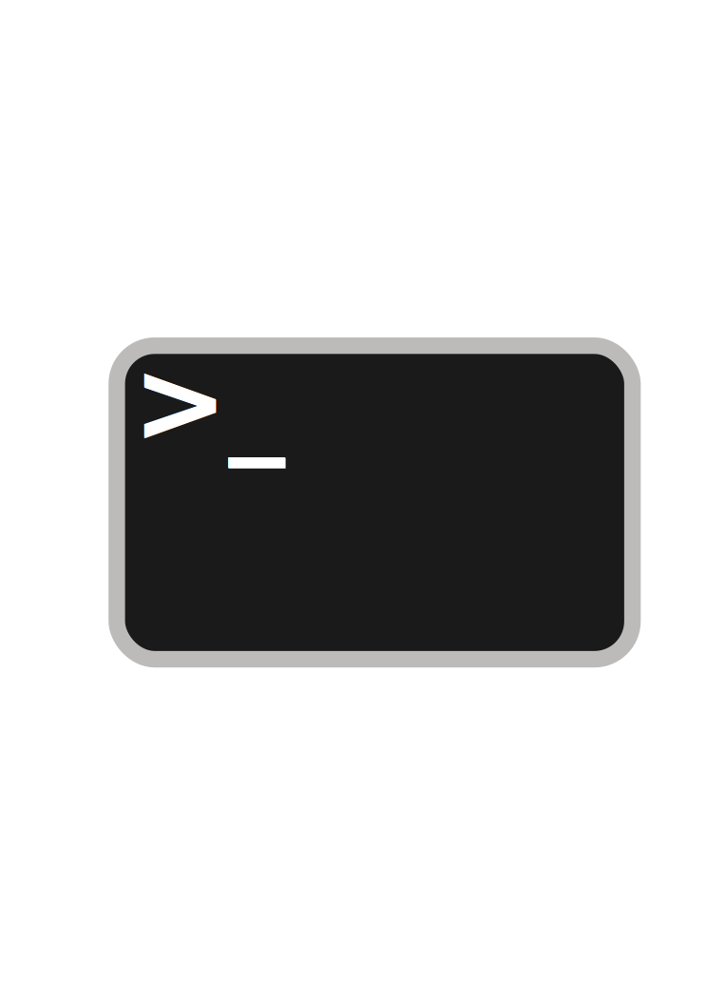

  

### Hi there 👋

<article class="markdown-body entry-content container-lg f5" itemprop="text"> I'm Olusegun Mayungbe, a software engineer that lives on  in the ☁️

 

I'm Enthusiastic about Linux, DevOps, Automation, and the Cloud Space. I have spent a few years as a Submarine Optical Network Engineer helping content providers move their content from Europe to Africa via the Submarine cable system. I have been able to deliver over 1.2Tbps of bandwidth on the Submarine and Terrestrial Optical systems.
  I have always been interested in building hence me finding my way towards the Cloud and DevOps space.

   

I am available and open to collaborating on DevOps Projects and roles both On-site and remote and I can be reached via <a href="akintunero101@gmail.com">akintunero101@gmail.com</a> 

  

   

<!--
**Oluadepe/Oluadepe** is a ✨ _special_ ✨ repository because its `README.md` (this file) appears on your GitHub profile.
-->

Here are some ideas to get you started:

- 🔭 I’m currently working on ...
- 🌱 I’m currently learning ...
- 👯 I’m looking to collaborate on ...
- 🤔 I’m looking for help with ...
- 💬 Ask me about ...
- 📫 How to reach me: ...
- 😄 Pronouns: ...
- ⚡ Fun fact: ...
